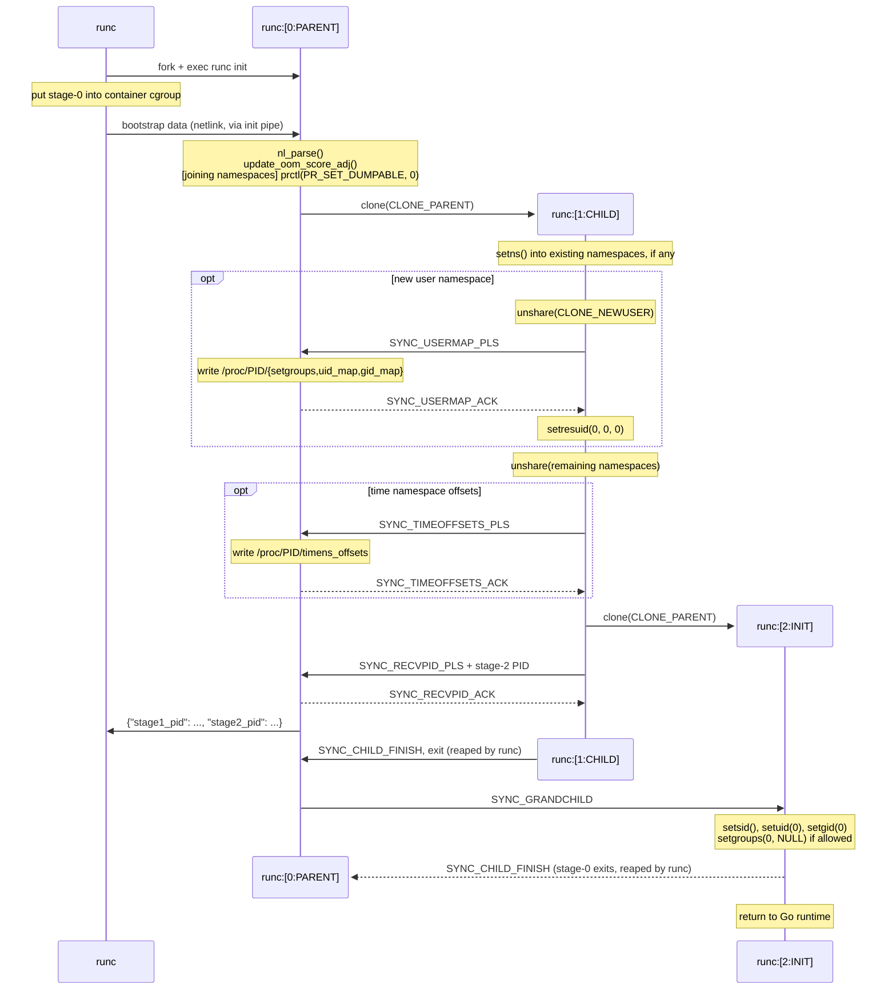

## nsenter

The `nsenter` package registers a special init constructor that is called before
the Go runtime has a chance to boot.  This provides us the ability to `setns` on
existing namespaces and avoid the issues that the Go runtime has with multiple
threads.  This constructor will be called if this package is registered,
imported, in your go application.

The `nsenter` package will `import "C"` and it uses [cgo](https://golang.org/cmd/cgo/)
package. In cgo, if the import of "C" is immediately preceded by a comment, that comment,
called the preamble, is used as a header when compiling the C parts of the package.
So every time we  import package `nsenter`, the C code function `nsexec()` would be
called. And package `nsenter` is only imported in `init.go`, so every time the runc
`init` command is invoked, that C code is run.

Because `nsexec()` must be run before the Go runtime in order to use the
Linux kernel namespace, you must `import` this library into a package if
you plan to use `libcontainer` directly. Otherwise Go will not execute
the `nsexec()` constructor, which means that the re-exec will not cause
the namespaces to be joined. You can import it like this:

```go
import _ "github.com/opencontainers/runc/libcontainer/nsenter"
```

`nsexec()` will first get the file descriptor number for the init pipe
from the environment variable `_LIBCONTAINER_INITPIPE` (which was opened
by the parent and kept open across the fork-exec of the `nsexec()` init
process). If it is not set, `nsexec()` returns right away, letting the Go
runtime start. Otherwise, it reads bootstrap data (namespace paths, clone
flags, uid and gid mappings, time namespace offsets, etc.) from the init
pipe, and proceeds in three stages, each one being a separate process:

* `runc:[0:PARENT]` (stage 0) is the process started by runc. It clones
  stage 1, and then performs on its behalf the operations which need to be
  done from outside of the new user namespace (writing user and group ID
  mappings and time namespace offsets). Once stage 2 is created, it sends
  the PIDs of both stage 1 and stage 2 to runc, tells stage 2 to proceed,
  waits for it to finish, and exits.
* `runc:[1:CHILD]` (stage 1) joins existing namespaces using `setns(2)`
  and creates new ones using `unshare(2)`, as specified by the bootstrap
  data. It then clones stage 2 and exits.
* `runc:[2:INIT]` (stage 2) does some final setup and returns to allow
  the Go runtime take over. This is the process which becomes the
  container's init (or the process being executed, for `runc exec`).

Both clones are done with `CLONE_PARENT`, so all three stages are children
of runc, which reaps stage 0 and stage 1 once they exit.

Stage 0 talks to stage 1 and stage 2 via two separate socket pairs
(`sync_child_pipe` and `sync_grandchild_pipe`), and sends the PIDs to
runc via the init pipe.

The following diagram shows the whole sequence. Here `runc` is the parent
process (`runc create` or `runc run`; for `runc exec`, the process is put
into the container cgroup at a different point), and the other three are
the `runc init` stages, named as they are shown in `ps` output.



NOTE: We do both `setns(2)` and `clone(2)` even if we don't have any
`CLONE_NEW*` clone flags because we must fork a new process in order to
enter the PID namespace.


